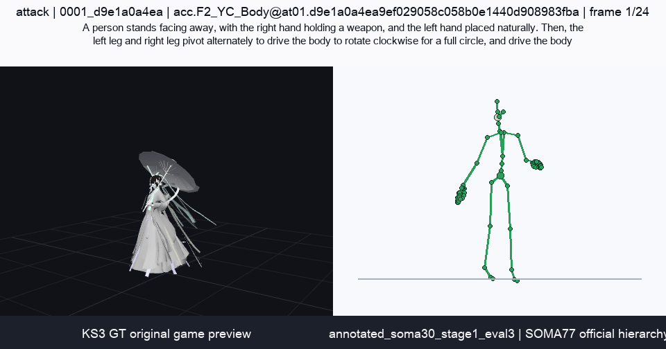
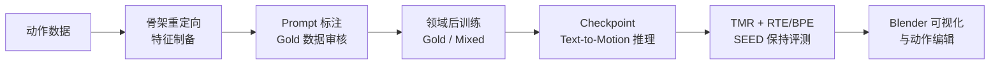
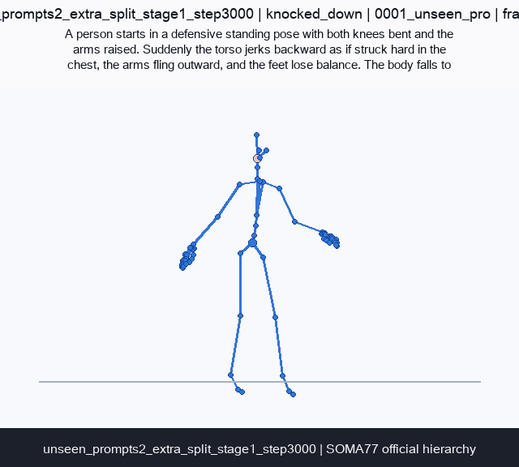
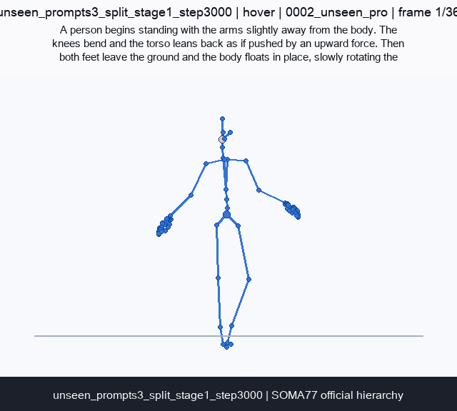

# Kimodo-SOMA-RP 后训练探索

**金山青训营结题项目** · Game Motion Domain Adaptation for Text-to-Motion

在官方后训练代码和原始商业训练数据未开放的条件下，本项目围绕 NVIDIA Kimodo-SOMA-RP-v1.1 自主恢复了一套可复现的领域后训练方法，重点增强攻击、跳跃、浮空和击倒等游戏动作的生成能力。

> **阶段性结论：**748 条人工审核的 Gold 数据证明了游戏动作域的可学习性；单域全参数微调会导致明显的原始能力遗忘，加入 SEED 回放数据的混合训练能够大幅缓解这一问题。

**快速入口：** [阅读完整报告](./full-report.html) · [下载 48 页 PDF](./Kimodo-SOMA-RP-report.pdf) · [查看 Markdown 原文](./source-report.md) · [启动交互展示](#本地预览)



## 项目概览

原始 Kimodo-SOMA-RP-v1.1 具备较好的通用文本到动作生成能力，但对大幅根节点位移、明显受击反馈和多阶段连续动作的表达仍然不足。本项目没有把验收目标设为“所有实验都必须正向”，而是建立一条可复现、可评估、能解释失败的完整研发链路。

项目分为两个阶段：

- **Phase 1，开源方法验证：**使用 SEED 细分子集打通后训练、Checkpoint 推理与 TMR/动作质量评测。
- **Phase 2，游戏动作域适配：**完成数据转换、Prompt 生成与人工标注、Gold 数据训练、混合训练、自定义评测以及 Blender 插件原型。

## 技术链路



评测不只看训练 loss 或单一文本匹配指标，而是同时覆盖：

| 维度 | 回答的问题 | 主要证据 |
| --- | --- | --- |
| 目标域效果 | 模型是否真的学会游戏动作？ | RTE、BPE、Contact、Foot Skate 与动作可视化 |
| 未见描述泛化 | 模型是否只记住训练 Prompt？ | Inplace、Knocked Down、Attack、Jump、Hover 新 Prompt |
| 原始能力保持 | 领域增强是否破坏通用能力？ | SEED Content / Repetition 的 R@K、T2M Similarity 和动作质量 |

## 关键结果

| 结果 | 证据 | 判断 |
| --- | --- | --- |
| **高质量数据比盲目扩规模更关键** | 7,951 条自动标注数据效果不稳定；转向 748 条人工审核 Gold 数据后，模型能够更有效地学习攻击、击倒和浮空等动作 | Motion-Prompt 对齐质量是当前主要瓶颈 |
| **游戏域动作可以被学习** | Gold 微调后，RTE 从 `0.5857` 降至 `0.3160`，BPE 从 `0.4933` 降至 `0.3247` | Kimodo 在结构上并非无法生成游戏动作 |
| **单域微调会造成灾难性遗忘** | Gold-only 模型的 SEED Content R@1 降至 `38.86%`，Repetition R@1 降至 `18.84%` | 只看目标域成绩会得到错误的模型选择结论 |
| **混合训练能大幅缓解遗忘** | 加入 SEED 回放数据后，Content R@1 恢复至 `95.33%`，Repetition R@1 恢复至 `79.54%`，游戏域效果基本保持 | 领域增强与通用语义能力保持并非不可兼得 |

### 已知边界

- Jump 和 Hover 的垂直 Root 轨迹仍不稳定。
- Attack 和 Jump 的下半身动态、Contact 和 Foot Skate 还需改善。
- 748 条 Gold 数据足以验证方法，但不能代表完整业务分布或最终生产训练集。
- 当前仓库是结题展示与证据档案，不包含受限制的内部数据、模型权重和完整训练工作区。

## 结果预览

| Unseen Prompt，击倒 | Unseen Prompt，浮空 |
| --- | --- |
|  |  |

更多攻击、跳跃、浮空、击倒、未见 Prompt 和能力保持 Case，请在本地打开 [`index.html`](./index.html) 或查看 [`assets/final`](./assets/final)。

## 交付内容

| 类别 | 本仓库内容 | 入口 |
| --- | --- | --- |
| 交互展示 | Blender 插件演示与 13 个结题章节 | [`index.html`](./index.html) |
| 完整报告 | 逐章正文、数据表与实验素材 | [`full-report.html`](./full-report.html) |
| PDF 报告 | 48 页最终结题报告 | [`Kimodo-SOMA-RP-report.pdf`](./Kimodo-SOMA-RP-report.pdf) |
| 原始文档 | 可检索的 Markdown 原文 | [`source-report.md`](./source-report.md) |
| 实验媒体 | 43 个图片/动图素材与 Blender 插件演示视频 | [`assets/final`](./assets/final) |
| 训练实现 | 后训练配置、数据制备、推理评测与可视化脚本 | [`train`](./train) |
| 研究记录 | R-SDD 规范、实验协议、证据映射与协作记录 | [`R-SDD/kimodo`](./R-SDD/kimodo) |
| Blender 助手 | Kimodo 中文助手插件发布包 | [`proscenium-blender`](./proscenium-blender) |

## 仓库结构

```text
.
├── index.html                  # 交互式结题展示入口
├── full-report.html            # 完整报告网页版
├── Kimodo-SOMA-RP-report.pdf   # 最终 PDF 报告
├── source-report.md            # Markdown 报告原文
├── styles.css / app.js         # 展示页样式与交互
├── report.css                  # 完整报告样式
├── assets/final/               # 实验图片、动图与演示视频
├── train/                      # 训练配置与数据/评测脚本
├── R-SDD/kimodo/               # 研究规范、协议与证据记录
├── proscenium-blender/         # Blender 中文助手发布包
├── CONTRIBUTING.md             # 贡献指南
└── LICENSE                     # MIT License
```

## 本地预览

建议通过本地 HTTP 服务器打开展示，以确保视频和资源加载行为与正式网页一致。

```bash
git clone https://github.com/Calix-L/Kimodo-SOMA-RP-final-showcase.git
cd Kimodo-SOMA-RP-final-showcase
python3 -m http.server 8000
```

然后访问 [http://localhost:8000](http://localhost:8000)。也可直接使用 Chrome、Edge 或 Safari 打开 `index.html`；请保留原有目录结构，不要单独移动 HTML 或媒体文件。

展示页支持使用 `↑` / `↓` 或 `PageUp` / `PageDown` 在相邻章节间切换。

## 贡献

欢迎通过 Issue 或 Pull Request 补充文档、复现记录、评测建议与展示页问题。提交前请阅读 [`CONTRIBUTING.md`](./CONTRIBUTING.md)。

仓库中不应加入未授权数据、模型权重、私有 Prompt、凭据、训练缓存或无法追溯来源的媒体。

## 项目说明

- 本项目为 **金山青训营结题项目**。
- 本仓库主要用于展示结果与保存可公开的实验证据，不等同于完整训练代码和数据发行版。
- 本仓库以 [MIT License](./LICENSE) 开源。第三方模型、数据和媒体素材仍需遵守各自的许可条款与使用范围。
